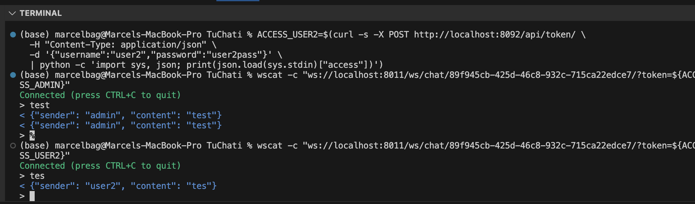
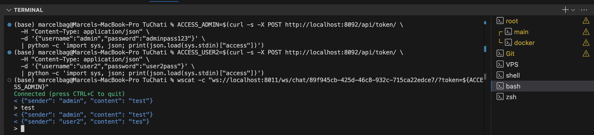

# 🌍 TuChati Connecting Africa, One Message at a Time

**TuChati** is a modern, secure, and lightweight communication platform built under the **Tuunganes** initiative designed to bring affordable, accessible, and private digital communication to African communities.

Our vision is to **empower individuals, organizations, and communities across Africa** with a unified platform for **messaging, voice, and video communication** optimized for regions with **low or unstable internet connections**.

---

## 🚀 Project Overview

TuChati is a full-stack communication platform developed using:

- **Backend:** Django + Daphne (ASGI) + Redis + WebSockets  
- **Frontend:** React (Web)  
- **Mobile:** React Native (Android & iOS – planned)  
- **Deployment:** Nginx + Docker + VPS (Hostinger / tuunganes.com)  
- **Database:** PostgreSQL  
- **Security:** JWT Authentication + HTTPS + Role-based Access Control  

TuChati provides a **real-time chat experience** (private and group messaging) with **low bandwidth usage**, **local data caching**, and **end-to-end encryption (planned)** ensuring messages and calls remain secure and accessible even in remote areas.

---

## 💡 Core Mission

> “To connect communities with affordable, secure, and inclusive digital communication tools made for Africa.”

TuChati aims to reduce digital isolation by offering communication services that:
- Function on **low-speed connections**
- Minimize **data usage costs**
- Maintain **privacy and security**
- Work **across web, Android, and iOS**

---

## 🧩 Key Features

| Feature | Description | Status |
|----------|--------------|--------|
| 🔐 User Authentication | Email + Password Login, JWT Token System | ✅ Done |
| 💬 Real-Time Chat | One-to-one and group conversations via WebSockets | ✅ Done |
| 📞 Voice Calls | Peer-to-peer WebRTC audio calling | 🔧 In Progress |
| 🎥 Video Calls | Lightweight WebRTC integration | 🔧 In Progress |
| 🗂️ File Sharing | Send and receive images, docs, and audio | 🚧 Planned |
| 📴 Offline Mode | Caching and local queue for low-network conditions | 🚧 Planned |
| 📱 Mobile Apps | Android and iOS via React Native | 🚧 Coming Soon |
| 🌍 Multi-Language | English, French, Swahili, German, Lingala | ✅ Done |
| 🔒 End-to-End Encryption | Strong privacy layer | 🚧 Planned |

---

## ⚙️ Tech Architecture
```
tuchati/
├── backend/
│ ├── tuchati_config/ # Django configuration
│ ├── apps/
│ │ ├── accounts/ # Auth & profiles
│ │ ├── chat/ # Messaging & WebSockets
│ │ ├── calls/ # Voice/video integration
│ └── ...
├── frontend/
│ ├── src/
│ │ ├── components/ # React UI components
│ │ ├── pages/
│ │ ├── services/
│ │ └── sockets/
│ └── ...
├── mobile/ (planned)
│ └── React Native project
├── docker/
│ ├── compose.yml
│ ├── compose.dev.yml
│ └── nginx.conf
└── README.md
```


---

## 🌐 Environments

| Environment | URL | Purpose |
|--------------|-----|----------|
| **Production** | [https://tuchati.tuunganes.com](https://tuchati.tuunganes.com) | Live environment |
| **Development** | Localhost / dev | Ongoing development |

---

## 🔐 Security & Privacy

TuChati respects your privacy.  
All communications are encrypted in transit using **HTTPS and secure WebSockets (WSS)**.  
Future releases will integrate **end-to-end encryption** and **temporary message storage policies** to ensure confidentiality and low storage usage.

---

## 📈 Roadmap

| Phase | Objective | Timeline |
|--------|------------|-----------|
| **Phase 1 (Q4 2025)** | Core messaging, login system, Docker & VPS deployment | ✅ Done |
| **Phase 2 (Q1 2026)** | Add voice/video calls via WebRTC | 🔧 In Progress |
| **Phase 3 (Q2 2026)** | React Native Android app beta | 🚧 Planned |
| **Phase 4 (Q3 2026)** | iOS app + offline sync + media optimization | 🚧 Planned |
| **Phase 5 (Q4 2026)** | End-to-end encryption & community deployment | 🚧 Planned |

---

## 💪 Contributors

| Role | Name | Description |
|------|------|-------------|
| 🧠 Founder & Architect | **Marcel Shabani (Tuunganes Initiative)** | Backend & System Architecture |
| 💻 Lead Developer | **Himmel Bag** | Full-stack development |
| 🌍 Community Partners | Coming soon | NGOs, Educational & Local Network Support |

---

## ❤️ Support Our Mission

TuChati is a community-driven initiative.  
If you believe in **digital inclusion for Africa**, you can help by:

- ⭐ Starring this repo  
- 🧩 Contributing code or translations  
- 💬 Sharing TuChati with your community  
- 💰 Supporting hosting and infrastructure costs  

Contact us at **support@tuunganes.com** or visit [https://tuunganes.com](https://tuunganes.com)

---

## 📜 License

MIT License free to use, modify, and distribute for non-commercial or community projects.  
For enterprise use or regional deployment partnerships, contact **tuunganes.com**.

---





> *“TuChati built in Africa, for Africa. Because connection should never depend on privilege.”*
